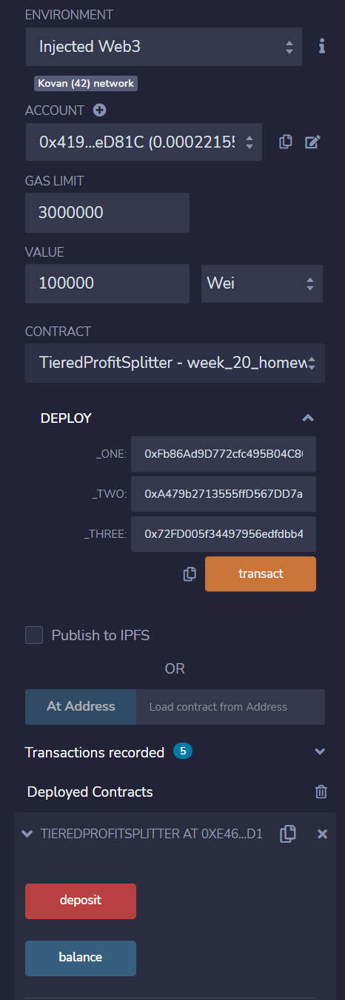

# Week20 Homework

## Smart contracts built with Solidity
I created three contracts to automate company finances.

### AssociateProfitSplitter contract
This will accept Ether into the contract and divide the Ether evenly among the associate level employees. This will allow the Human Resources department to pay employees quickly and efficiently.

The contract is deployed.

The contract was deployed successfully.

Depossit function is called.  60000 Wei is distributed to three addresses.

Deposit funcation call was successful.  Each address received 20000 Wei.

The balance of the contract is checked.  The balance is 0.

### TieredProfitSplitter 
This will distribute different percentages of incoming Ether to employees at different tiers/levels. For example, the CEO gets paid 60%, CTO 25%, and Bob gets 15%.

The contract is deployed.

The contract was deployed successfully.

Depoist function is called.  100000 Wei is ditributed to three addresses in differenct proportions (50%, 25% and 20%).

Deposit function call was successful. Employees one, two and three reiceived their portions out of 100000 Wei.  The remainder was received by emplyee one.

The balance of the contract is checked. The balance is 0.

### DeferredEquityPlan 
This models traditional company stock plans. This contract will automatically manage 1000 shares with an annual distribution of 250 over 4 years for a single employee.

The contract is deployed.  The deployed contract has a fastfoward function added which fastforwards time by 365 days. So we don't need to wait for 365 days to test the contract!

The contact was deployed successfully.

Tha balance is checked before distribution.

Fastforwarded 365 days and the emplyee is entitled for the first distribution.

The first distribution was made.

The balance is checked.

Fastforwarded 365 days again and the emplyee is entitled for the second distribution.

The second distribution was made.

The balance is checked.

Fastforwarded 365 days again and the emplyee is entitled for the third distribution.

The third distribution was made.

The balance is checked.

Fastforwarded 365 days again and the emplyee is entitled for the fourth distribution.

The fourth distribution was made.

The balance is checked.

Fastfowarded 365 days again and see what happens...

Distribution is called.  But it generated error as the full distribution of 1000 was already made.

